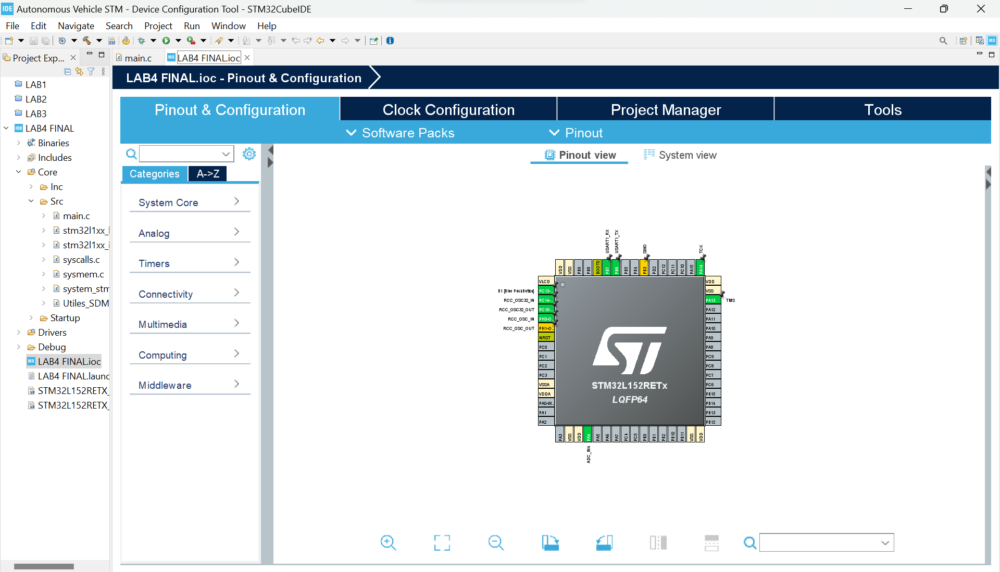

# Robot with Obstacle Detection


## Overview

Autonomous Vehicle Project developed in STM Cube IDE and coded in C, shows our acquired knowledge in several peripherals controlled by the microcontroller NUCLEO-L152RE Board.

This are the general purposes and challenges of the project:

<ul>
  <li>Learn microcontroller programming techniques.</li>
  <li>Design a hardware-software system.</li>
  <li>Learn to debug and verify the operation of the hardware-software developed.</li>
  <li>Improve the capacity for design and innovation.</li>
  <li>Stimulate the capacity for collaboration and participation in a work team.</li>
</ul>

The Project consists in the development of a robot with an obstacle detection mechanism. The
functionalities are the following:

<ul>
  <li>Movement forward and backward in a straight line</li>
  <li>Speed selection</li>
  <li>Turn to both sides</li>
  <li>Measurement of the distance to an obstacle when the robot is moving forward</li>
  <li>Stop the movement of the robot when an obstacle is detected at less than 10 cm</li>
  <li>Reduce the speed of the robot progressively when an obstacle is detected at less than 20 cm</li>
  <li>Generate acoustic signals depending on the proximity of the obstacle</li>
  <li>Communication with a device (PC or mobile phone), which includes receiving commands</li>
  <li>Bluetooth communication with a mobile phone that controls the robot movement</li>
</ul>

## Technologies Used

[](https://en.wikipedia.org/wiki/C_(programming_language))
[](https://www.st.com/content/st_com/en.html)


## Requirements

Install and configure [STM32CubeIDE](https://www.st.com/en/development-tools/stm32cubeide.html#get-software).



## Project

This is the general structure of the project. The folders LAB1, LAB2, LAB3 and LAB4 are STM32 projects that can be directly used in the STM32CubeIDE. There, we show the improvements done during the development of this project.

<ul>
  <li>
    <b>Documentation</b>:
    In this folder you will find all the important documentation including flow charts, the final code, a report of the project and a block diagram.
  </li>
  <li>
    <b>LAB1</b>:
    In the first step of the project we started making use of the motors of the robot. This include setting up the registers and making use of simple digital outputs.
  </li>
  <li>
    <b>LAB2</b>:
    We started making use of the ultrasonic sensor and buzzer, implementing code regarding calculating the distance between an object and the sensor, and producing sound with the buzzer when there was a small distance to the object.
  </li>
  <li>
    <b>LAB3</b>:
    We started developing the sequence when the robot approaches an object ín automatic mode, so it never collides and making it definitely autonomous.
  </li>
  <li>
    <b>LAB4 FINAL</b>:
    Deploy communication between PC and microcontroller via USART or between phone and microcontroller via Bluetooth, making use of a bluetooth sensor. This is the complete project with all the functionalities. This final version takes into account several peripherals, all controlled by different service routines, with timers and interrupts.
  </li>
</ul>

## Installation

1. `Clone` this repository into your STM32 projects folder.
   
```bash 
git clone https://github.com/javierortizmi/AutonomousVehicle.git
```

2. Open the Project in the STM32CubeIDE.

3. Run the code in your ST Microcontroller.

## License

[](LICENSE)